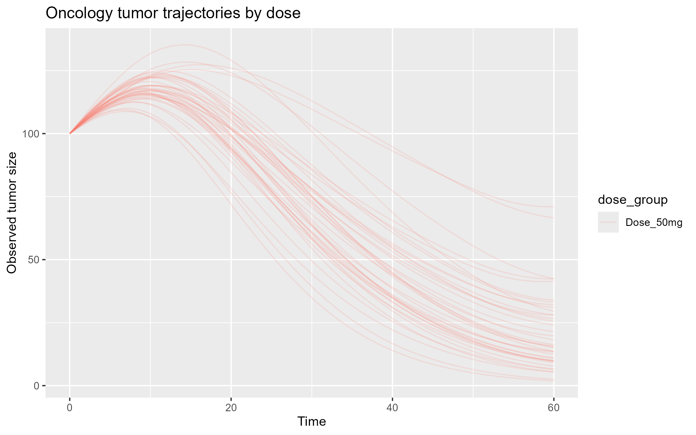
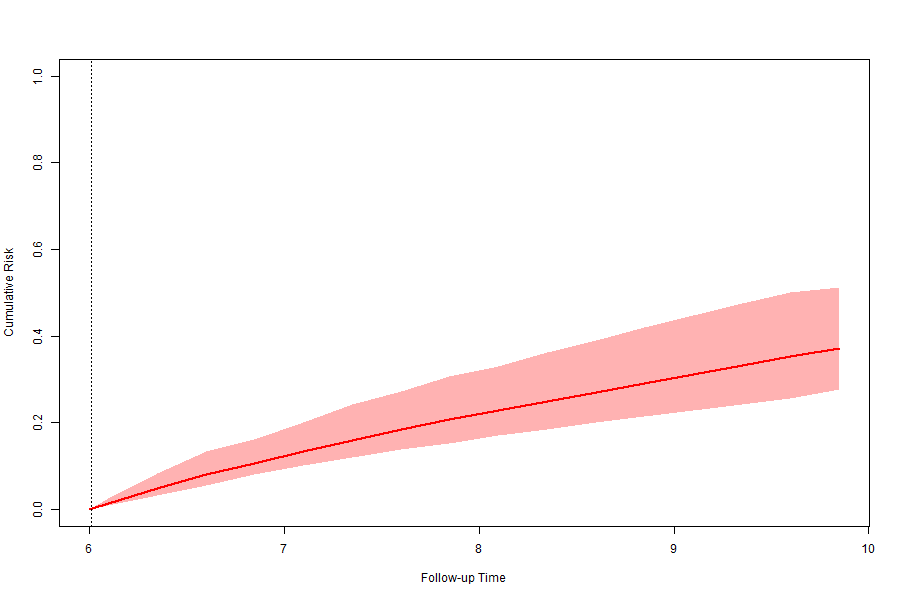

# MIDD Oncology & RWE Framework

End-to-end R framework for Model-Informed Drug Development (MIDD) and Real-World Evidence (RWE), combining causal inference, PK/PD simulation, tumor dynamics, survival analysis, joint modeling, dynamic prediction, and Bayesian adaptive dose optimization.

## Project Overview

This project demonstrates how quantitative methods can be integrated across the drug development lifecycle:

- Real-World Evidence (RWE) causal inference using propensity scores and IPTW
- Repeated-dose PK simulation
- PK/PD biomarker and tumor dynamics modeling
- Disease progression modeling
- Survival analysis and joint longitudinal-survival models
- Dynamic risk prediction
- Adaptive trial simulation
- Bayesian dose selection

The framework is designed as a portfolio-grade project for quantitative clinical modeling, pharmacoepidemiology, and MIDD applications.

---
## Key Results

### Tumor Dynamics Simulation



Simulated tumor trajectories under different dose levels using a mechanistic oncology model (Simeoni model). Higher doses lead to stronger tumor shrinkage.

---

### Dynamic Risk Prediction



Patient-specific prediction of future event risk based on tumor trajectory using joint modeling. This enables individualized risk assessment at interim timepoints.

---

### Bayesian Dose Selection


Posterior probability-based dose selection demonstrating robust identification of the optimal dose across simulated trials.

---


## Key Components

### 1. Real-World Evidence (RWE)
Implemented reusable R functions for:

- propensity score estimation
- inverse probability of treatment weighting (IPTW)
- weighted Cox models
- balance diagnostics

### 2. PK/PD and Disease Modeling
Implemented repeated-dose PK simulation and exposure-response modeling, including:

- one-compartment PK model
- Emax pharmacodynamic model
- longitudinal biomarker simulation
- mechanistic oncology tumor growth model (Simeoni model)

### 3. Survival and Joint Modeling
Implemented:

- Cox proportional hazards models
- longitudinal mixed-effects models
- joint longitudinal-survival models using `JMbayes2`
- dynamic prediction of individual event risk

### 4. Adaptive Trial Simulation
Implemented:

- interim analysis framework
- frequentist adaptive dose selection
- Bayesian dose optimization
- operating characteristics across repeated simulated trials

---

## Scientific Workflow

```text
Dose regimen
↓
PK simulation
↓
PD / biomarker or tumor dynamics
↓
Disease progression
↓
Survival risk
↓
Joint modeling
↓
Dynamic prediction
↓
Adaptive decision / dose optimization

Project Structure
MIDD_RWE_Project/
├── data/
├── functions/
│   ├── rwe/
│   └── midd/
│       └── oncology/
├── scripts/
│   ├── exploratory/
│   └── pipeline/
├── reports/
├── renv.lock
└── README.md

Main Methods and Packages
survival
nlme
JMbayes2
deSolve
ggplot2
dplyr

Example Outputs

The framework produces:

propensity-score weighted treatment effect estimates
repeated-dose PK profiles
biomarker trajectories
tumor growth/shrinkage trajectories
Cox model estimates
joint model estimates
dynamic patient-specific risk predictions
adaptive trial decisions
Bayesian dose selection probabilities
Example Oncology Insight

---


How to Run
Example pipeline scripts
scripts/pipeline/01_simulate_trial.R
scripts/pipeline/02_fit_models.R
scripts/pipeline/03_dynamic_prediction.R
scripts/pipeline/04_adaptive_trial.R
scripts/pipeline/05_oncology_simulate_trial.R
scripts/pipeline/06_oncology_fit_models.R
scripts/pipeline/08_oncology_joint_model.R
scripts/pipeline/09_oncology_joint_model_stable.R
scripts/pipeline/10_oncology_dynamic_prediction.R
scripts/pipeline/11_oncology_adaptive_trial_simulation.R
scripts/pipeline/13_oncology_bayesian_dose_optimization.R
scripts/pipeline/14_oncology_bayesian_operating_characteristics.R


Positioning

This project is relevant for roles such as:

Quantitative Scientist
MIDD Scientist
Pharmacometrics Scientist
Advanced Biostatistician
Real-World Data Scientist
Author

Blaise Mbunga Mputu
Senior Biostatistics / RWE / Quantitative Clinical Modeling